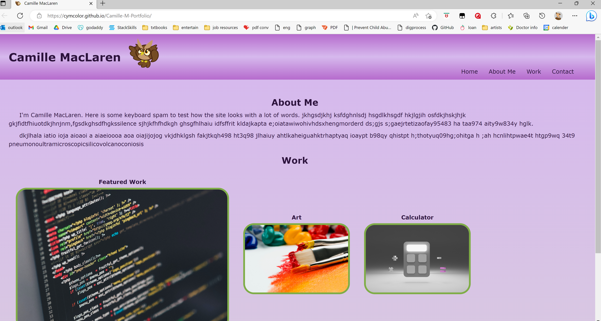

# Mod2-HW-CYM-Portfolio

## Description

This is a template website for a user portfolio.  

The header has a navigational bar that contains home, about me, work, and contact. About me, work, and contact will lead to their respective areas on the page. The home leads back to the main page and will only work on the NA page and the Art page.

Work has many images that are links. The feature image is larger than the others and currently link back to the the refactored code from the Rice Bootcamp assignment. The art will go to a new page will an art gallery.
The calculator and testing will go to a not available page.

The contact page has two links that will go to github and linkedin respectively.

## License

Please refer to the LICENSE in the repo.

## Link/Screentshot

https://cymcolor.github.io/Camille-M-Portfolio/
